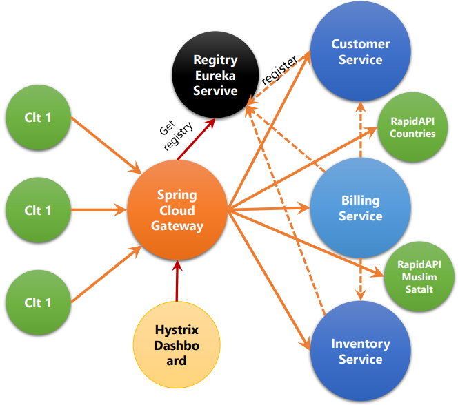

# Microservices 
## Definition
A Microservices' architecture is a way to design applications as a set of independently deployable services. These services should preferably be organized around business skills, automatic deployment, smart ends, and decentralized control of technology and data.
Proposed Architecture
The objective of this work is to show how to create several independently deployable services that communicate with each other, using the facilities offered by Spring Cloud and Spring Boot. Spring Cloud provides tools for developers to quickly and easily build common patterns of distributed systems (such as configuration, discovery, or intelligent routing services). Spring Boot, on the other hand, allows you to build Spring applications quickly as quickly as possible, while minimizing the usually tedious configuration time of Spring applications.
## Our architecture
We will therefore create the following microservices:

* Customer Service: Service that offers a REST API to manage customers.
* InventoryService: Service that offers a REST API to manage products.
* BillingService: Service that offers a REST API to manage billing.
* Gateway Service: single entry point for a collection of microservices.
* Discovery Service: Service allowing the registration of service instances with a view to being discovered by other services.

The resulting architecture will look like this:

